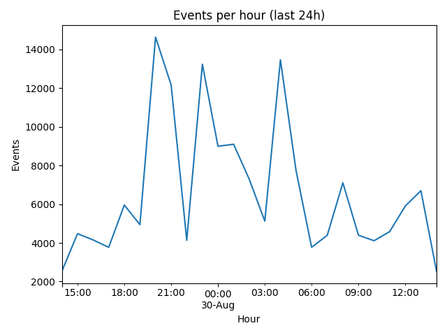
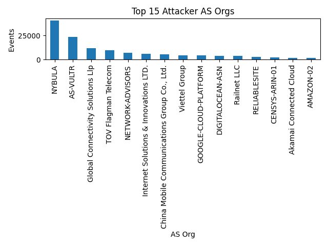
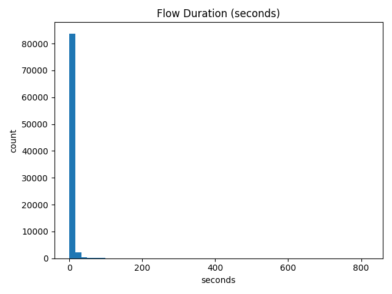

# Suricata Honeypot Analysis — 24h Snapshot

📊 A 24-hour analysis of honeypot traffic collected with **T-Pot Suricata**.  
Includes raw CSV exports, summary tables, and visualizations of attack patterns.

---

## Key Findings
- **Total events:** 165,197  
- **Peak hour:** Aug 29, 20:00 CT (~14,636 events)  
- Top ASNs: **NYBULA (40k)**, **AS-VULTR (23k)**, **Global Connectivity Solutions LLP (11.9k)**  
- Top IPs: `144.202.75.221`, `196.251.66.157`, `196.251.66.164`, `46.46.101.89`, `208.67.108.93`  
- Most flows lasted <1s → scans; very few brute-force attempts.  
- Only **2 severity-1 alerts** in the dataset.

---

## Visuals
  
  
  

---

## Repo Contents
- `analyze_suricata_24h.py` → Python script to parse Suricata CSVs  
- `flows_minimal.csv` → clean dataset for ML experiments  
- `top_ips.csv`, `top_as_orgs.csv`, `hourly_counts.csv`, `alert_categories.csv`, `alert_severity.csv`  
- Charts: `timeline_hourly.png`, `top_as_orgs.png`, `duration_hist.png`  
- `report.md` → detailed findings & recommendations  

---

## Usage
```bash
python analyze_suricata_24h.py your_export.csv --tz America/Chicago --outdir report_out
