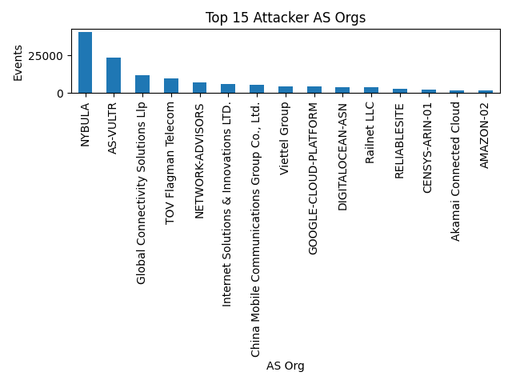

# Suricata Honeypot Report — 24h Snapshot

**Time window:** Aug 29, 2025 00:00 CT → Aug 30, 2025 00:00 CT  
**Total events:** 165,197  
**Unique source IPs:** 200  
**Peak activity:** Aug 29, 20:00 CT with ~14,636 events  

---

## Key Findings

### Attacker Infrastructure
- Top ASN: **NYBULA** (40,479 events, ~24% of all traffic)  
- **AS-VULTR** (23,349) and **Global Connectivity Solutions LLP** (11,926) also heavily represented  
- Smaller but notable contributions from **Flagman Telecom**, **Network-Advisors**, **China Mobile**, **Viettel Group**, and **Google Cloud**  

### Top Source IPs
- `144.202.75.221` — 22,862 events, ~1.5 MB sent / 2 MB received → clear interactive traffic, likely brute attempts  
- `196.251.66.157` & `196.251.66.164` — ~20,200 events each, but 0 bytes exchanged → pure scanning behavior  
- `46.46.101.89` — 9,498 events, 1.6 MB → 1.1 MB traffic  
- `208.67.108.93` — 7,218 events, ~930 KB inbound, minimal outbound → TLS-related scans/probes  
- Other bursts from `5.181.86.95`, `223.75.200.223`, `115.73.213.125`, etc.  

### Flow Characteristics
- Majority of flows lasted **< 1s**, confirming scanning dominance  
- A small tail of longer-lived flows indicates attempted brute-force or interactive sessions  

### Alerts (Suricata Signatures)
- 6,424 events tagged as *Generic Protocol Command Decode* (low-value noise)  
- Other categories: *Misc activity (261)*, *Detection of Network Scan (166)*, *Not Suspicious Traffic (47)*  
- Only **2 high-severity (sev=1)** alerts in the entire dataset  
- 11 severity-2 alerts detected, the rest (6,898) were severity-3 (low)  

---

## Visuals

### Events per Hour
Clear peak around 20:00 CT (14.6k events in one hour)  

### Top AS Orgs
NYBULA and Vultr dominate incoming traffic  

### Flow Durations
Majority of connections terminate in <1s, consistent with scanning  

---

## Recommendations

### Detection Rules
- Flag any IP with >100 SSH connections within 10 minutes  
- Correlate flows with credential captures (Heralding, Cowrie, etc.) to spot brute-force attempts  
- Prioritize only severity 1–2 alerts in dashboards to cut noise  

### Defensive Actions
- Rate-limit or temporarily block `/24` networks from NYBULA and Vultr (they accounted for nearly half of all events)  
- Track recurring ASNs (NYBULA, Vultr, China Mobile) across multiple days for persistent infrastructure  

### Research & Portfolio Extensions
- Expand dataset to 72h or 1 week to identify persistence and recurring campaigns  
- Build Splunk/Kibana dashboards for hourly trends, top ASNs, alert categories  
- Use `flows_minimal.csv` to create a basic ML classifier distinguishing scans vs. brute-force attempts  
- Document repeated ASNs and IPs in an “Attacker Infrastructure” section for long-term threat intel  

---

## Project Contents

📂 suricata-24h-report/

├── analyze_suricata_24h.py # Python analysis script

├── flows_minimal.csv # Clean dataset for ML

├── top_ips.csv

├── top_as_orgs.csv

├── hourly_counts.csv

├── alert_categories.csv

├── alert_severity.csv

├── timeline_hourly.png

├── top_as_orgs.png

├── duration_hist.png

├── alert_severity_distribution.png

├── alert_category_distribution.png

└── report.md # This full report
